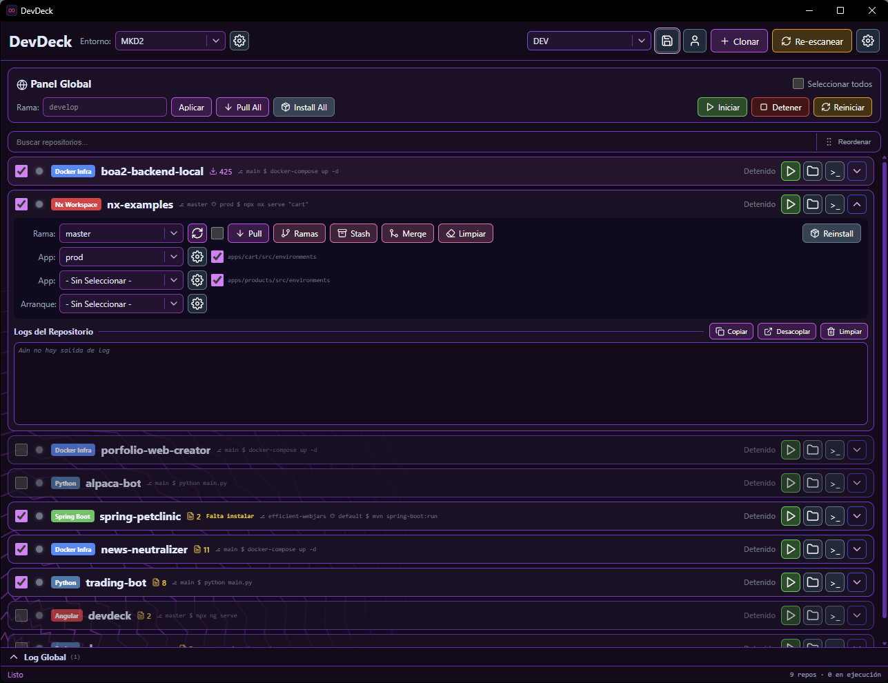

# DevDeck

**Your whole local dev environment, in one window.**



DevDeck is a desktop app that turns a folder full of repositories into a control panel. Point
it at your workspace and it figures out what each repo is (Spring Boot, Angular, React, Nx,
Maven, Docker Compose, …) and gives you a card for each one with **start / stop / configure**
buttons, live git status, Docker Compose controls, log windows, and shareable profiles — no
more juggling a dozen terminals.

## What you get

- **Service supervision** — start, stop and restart dev services with a live status indicator.
  Each service runs in its own process group with reliable cleanup, so nothing is left
  dangling when you stop it.
- **Detached log windows** — open a live log window per service and drag it to a second
  monitor.
- **Git at a glance** — branch badges and status on every card; pull, merge (with revert
  points), stash and switch branches without leaving the app.
- **Docker Compose** — bring a repo's compose services up or down and watch their status.
- **Interactive terminals** — open a real PTY terminal scoped to any repository.
- **Command profiles per repo** — save several named launch configurations for a service
  (different args, env or start commands) and switch between them on the fly.
- **Workspace profiles** — snapshot your whole setup (selected branches, env files, which
  services are running) and restore or share it later.
- **Multiple environments** — group your repos into environments and switch between them; a
  banner warns you if services are still running in the one you left.
- **Find and arrange** — a live search box filters the repository list by name, and you can
  drag cards into a custom order that's remembered between sessions.
- **Theming** — pick a color palette (Indigo, Slate, Emerald, Crimson, Rose or Light) and a
  background pattern; the whole UI, including action buttons, adopts it instantly.
- **System tray** — close to tray and reopen from a quick-control panel (Windows/macOS) or a
  native tray menu (Linux).
- **Config-driven detection** — repository types are described by YAML. Adding support for a
  new framework is a new YAML file, not a new build. Recognised out of the box:
  Spring Boot, Angular, React, Nx workspace, Maven library, Go, Rust, Python,
  Laravel, CodeIgniter, and Docker Compose infra.
- **Cross-platform** — native builds for Windows and Linux.
- **Bilingual UI** — English and Spanish.

## Install

You don't need to build anything — grab the right file for your OS from the
[Releases page](https://github.com/Jorditomasg/devdeck/releases) and run it.

**Windows**

1. Download `DevDeck_<version>_x64-setup.exe` and run it. The installer isn't code-signed, so
   Windows SmartScreen may warn about an "unknown publisher" — click **More info → Run anyway**.

**Linux**

- **Portable (no install):** download `DevDeck_<version>_amd64.AppImage`, make it executable
  and run it:
  ```bash
  chmod +x DevDeck_*_amd64.AppImage
  ./DevDeck_*_amd64.AppImage
  ```
- **Debian / Ubuntu:** install the `.deb`:
  ```bash
  sudo apt install ./DevDeck_*_amd64.deb
  ```

On **first run**, pick your workspace folder — the directory that holds your project
repositories.

DevDeck updates itself: when a new version is released, the app detects it and installs the
update from within DevDeck — no manual re-download. (Self-update covers the Windows installer
and the Linux AppImage; `.deb` installs update by re-downloading the package.)

DevDeck scans the folder and shows one **card per repository**. From each card you can start,
stop and restart the service, open a live log window, run git operations, bring Docker Compose
services up or down, and open a terminal scoped to that repo. Save a **profile** to snapshot
your whole setup and restore it later.

## Config locations

All persistence lives in OS-standard directories — never in the install dir, so uninstalling
or reinstalling never touches your data.

| What | Windows | Linux |
|---|---|---|
| App config (`config.json`) | `%APPDATA%\devdeck\` | `~/.config/devdeck/` |
| Repo-type overrides | `%APPDATA%\devdeck\repo-types\` | `~/.config/devdeck/repo-types/` |
| Profiles | `%APPDATA%\devdeck\profiles\` | `~/.local/share/devdeck/profiles/` |

Drop a repo-type YAML file into the **overrides** dir to add or replace a detection rule: the
files there are merged over the bundled set by `type` id (same id replaces a bundled
definition, a new id adds a type) — no code changes, no rebuild.

## Code signing

DevDeck has applied to the [SignPath Foundation](https://signpath.org) free
code-signing program for open source projects. Once the certificate is issued,
Windows installers will be signed with it. See the
[Code Signing Policy](docs/code-signing.md).

## License

DevDeck is released under the [MIT License](LICENSE).
